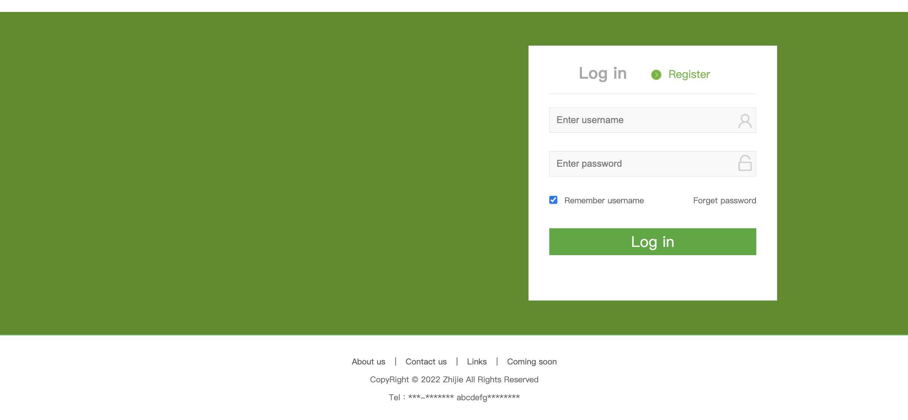

# Fresh_food_E-commerce
**Fresh Food E-commerce** : is a small e-commerce shopping site like [ICA](https://handla.ica.se), [Willys](https://www.willys.se) or [Mathem](https://www.mathem.se) in Sweden. 

## Technologies used 
 - Python 3
 - Django 2 

## Functionality
- Login and Registration
- Product browsing: Product pictures, price, type, introduction and stock information.
- User Center: Support the update of user's personal information, delivery address and other information, add products to shopping carts, and generate orders.
- Submit order and payment

## Setup
**Install dependencies**: `pip install -Ur requirements.txt`

## Database
Use default database `sqlite` when creating the `Django` project

## Run server

Run the following command: 
`python manage.py runserver` then open it with Chrome browser: http://127.0.0.1:8000/ 

## Screenshots

